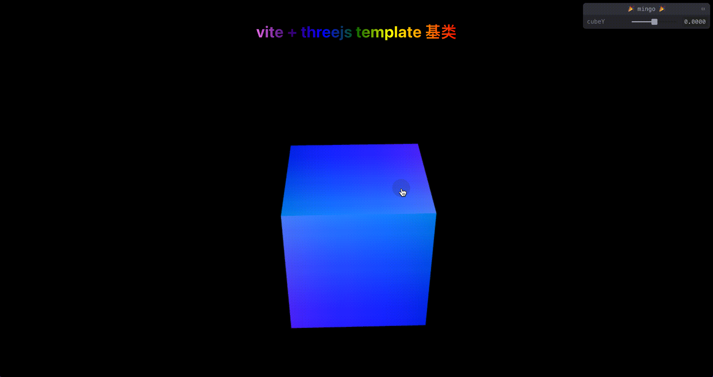

# Vue 3 + TypeScript + Vite + Three.js 基础模板

该模板项目借鉴作者**GhostCatcg** 项目[three-ts-webpack](https://github.com/GhostCatcg/three-ts-webpack),再此基础上，替换了构建工具vite，更改项目运行架构,并加入了一些小的个人偏好性修改。



## 项目使用流程

### 安装 
`pnpm i`
### 运行 
`pnpm dev`

### 构建
这边构建分两种类型：
`pnpm build`
第一种是整个vue项目进行构建打包，会包含所有的路由。

`pnpm build:one`
第二种是单模块（单个3d场景打包成一份静态资源），可以用于单独部署或者应用。

打包哪个模块取决于你的入口文件应用了哪份数据
入口文件位置：`src/scripts/buildEntry.ts`

```
import World from '@/case/PlanetWorld';
const dom = document.querySelector('#threejs-canvas') as HTMLElement;
new World({
  dom,
});
```
需要替换新的案例，只需要更改这边的引用路径 `@/case/*`

## 功能
- 加载资源
- 使用着色器
- 最新gui面板 - tweakpane
- gasp动画